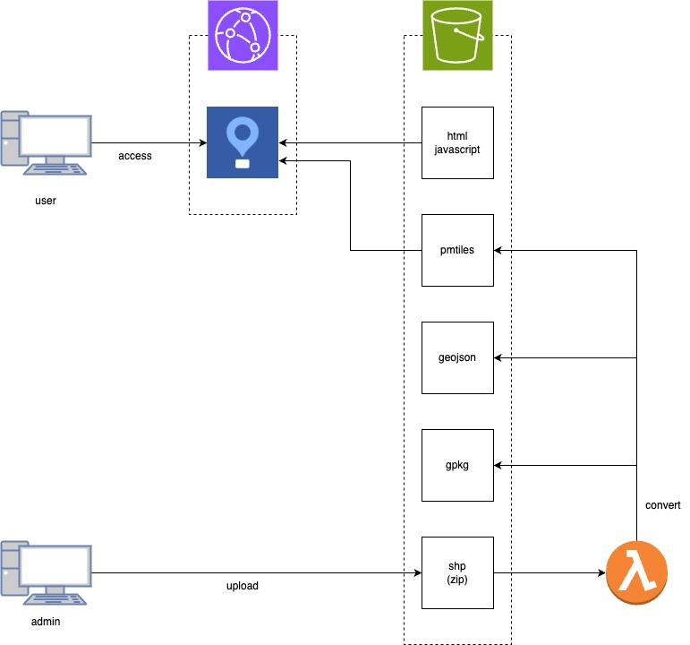

# disaster-prevention-map
位置情報エンジニア養成講座の防災マップアプリケーションです。ハッカソンで「AWSなんもわからん」ということが分かったので、書籍の内容から外れますがCDK、Lambdaと仲良くなることにしました。

## ディレクトリ構成
```
disaster-prevention-map/
├── location-app/                 # フロントエンド（Vite+MapLibre GL JS）
├── cdk-s3-cloudfront-sample/     # AWS CDK IaC（インフラ管理）
    ├── convert-lambda/           # Lambda関数（shp->gpkg,geojson,pmtiles）
```

## インフラ構成


## その他
- 全国分を変換しようとするとLambdaのチューニングが大変になりそうだったので、東京都の避難所のみになっています。
- アプリケーションは以下で公開しています。
- https://d1z62ehlrono0i.cloudfront.net/
- 以下、本当に雑多な所感
    - 静的サイトならCloudFront + S3、動的サイトならAmplify + Svelte Kitで作ればいいか、という手札が持てる様になった。
    - ルーティングサーバー立てるのしんどいので、HERE APIで遊ぼうと思ったが、クライアント側に認証情報渡すの嫌で断念。
        - CSRとSSRの使い分けがしっくり来ていなかったが、「なるほど、こういう時にSSRを採用したくなるのか」とちょっと解像度が上がった気がする。
    - 「shp絶対許さん」
        - 属性名の制限やらで文字化けが発生した。許せない。
        - 単一ファイルじゃないのでzip化と解凍が必要になった。そして初歩的なミスをしてハマった。許せない。
            - そのおかげで、Lambdaのログを出力させることを覚えたので、結果的には良かったのかもしれない。けど許せない。
    - Lambdaの最適な設定を探るの難しい。
        - 処理時間の上限をあまり長くしたくないと思ってひよってたら、time overが発生した。
        - 全国データの変換時、メモリ不足が発生したっぽい。
